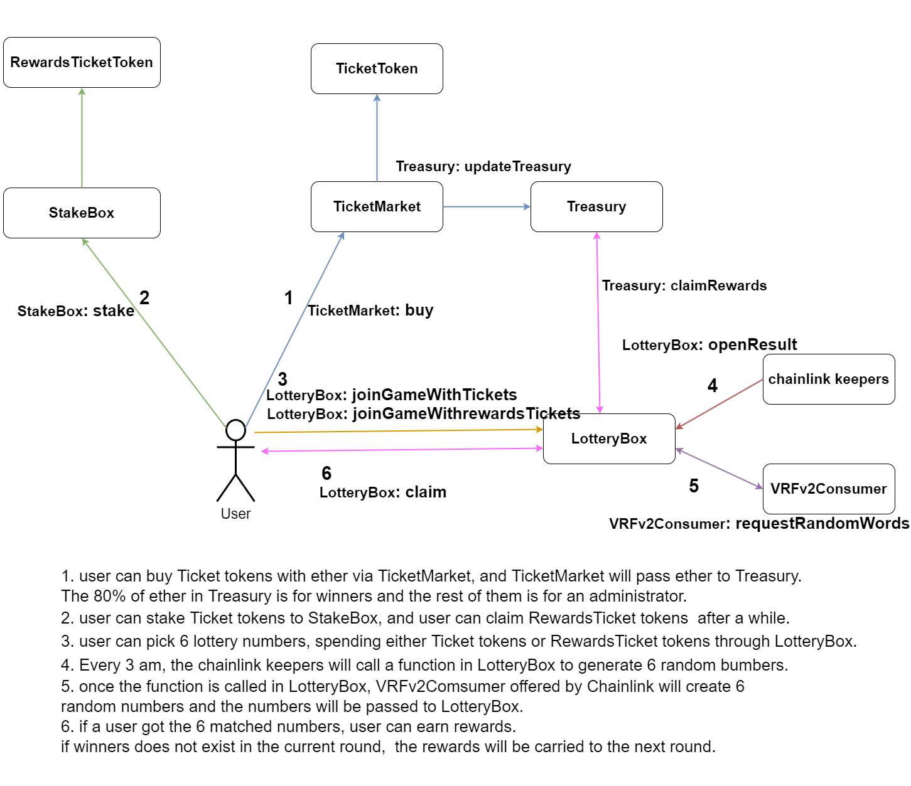

# SimpleLottery

Diagram

There are 7 smart contracts as follows;

1. TicketToken.sol (ERC20)
   TicketToken.sol is ERC20 based Tokens to play a lottery game.
   Basically, users are expected to spend this token to pick 6 lottery numbers.

2. TicketMarket.sol
   TicketMarket.sol is for users to buy Ticket tokens with ethers.
   Once TicketMarket receives ethers from users, ethers will be handed over to Treasury.

3. Treasury.sol
   Treasury.sol store ethers which users paid for Ticket tokens.
   The 80% of the ethers is going to be used for rewards for winners who mathced 6 lottery numbers.
   The 20% of the ethers is for an administrator.
   The rate for the admin can be changed to any rate; e.g. 10%;

4. StakeBox.sol
   StakeBox is where users can stake their ticket tokens.
   The benefits from it is that users can claim RewardsTicket tokens which can be used to play a lottery game.

5. RewardTicket.sol (ERC20)
   RewardTicket.sol is ERC20 based Tokens, and users can claim these tokens once they stake their ticket tokens into StakeBox.sol.
   These tokens are also used such as Ticket tokens for playing a lottery game.

6. LotteryBox.sol
   LotteryBox.sol is where users can play a lottery game by spending either Ticket tokens or RewardTicket tokens. The function named “openResult” will announce the winner’s numbers.The openResult function will be automatically called by chainlink keepers. If there are winners, winners can call the function “claim” to get their rewards sent from Treasury.sol.

7. VRFv2Consumer.sol
   VRFv2Consumer.sol is to generate 6 random numbers to be passed to LotteryBox.sol. Basically, Once the function “openResult” in LotteryBox.sol is called by chainlink keepers, the openResult will call this contract to gain 6 random numbers as winner numbers in each round.

Senario 1 : a user play a lotter game with ticket tokens

1. User can buy Ticket tokens with Ether from TicketMarket.sol.
2. Once a user gianed ticket tokens, the TicketMarket.sol send Treasury.sol Ether user sent.
3. Once the Treasury.sol received Ether from the TicketMarket.sol, the Treasury.sol will split the received ether in two; One for lottery rewards and One for admin.
4. a user can join a game throught the LotteryBox.sol by spending Ticket Tokens.
5. Everey 3 am, the chainlink keeper excutes the request the requestRandomWords function in the VRFv2Consumer.sol and executes the openResult function in LotteryBox.sol.

the requestRandomWords function in the VRFv2Consumer : To generate random numbers which is lottery winning numbers
the openResult function in LotteryBox.sol : To announce the winning numbers and move to the next round

Senario 2 : a user play a lotter game with rewards tokens

1. A user can stake his/her ticket toknes via the StakeBox.sol to get rewards ticket.
2. After user claimed rewards ticket tokens, a user can join a game throught the LotteryBox.sol by spending Ticket Tokens.
3. Everey 3 am, the chainlink keeper excutes the request the requestRandomWords function in the VRFv2Consumer.sol and executes the openResult function in LotteryBox.sol.

---

Process

Straighforwardly, You can visit "https://6303284a2a41dd2d7edb1c4e-funny-boba.netlify.app/"

1.  git clone https://github.com/hsjo12/SimpleLottery.git

2.  npm i

3.  cd frontend

4.  npm i

5.  npm run dev

---

Test

1. ticketTokens.sol, TicektMarket.sol
   npx hardhat test ./test/ticketTokens_TicektMarket.js

2.rewardTicektToken.sol, StakeBox.sol
npx hardhat test ./test/rewardTicektToken_StakeBox.js

3. lotteryBox.sol
   To be completed soon.

---
